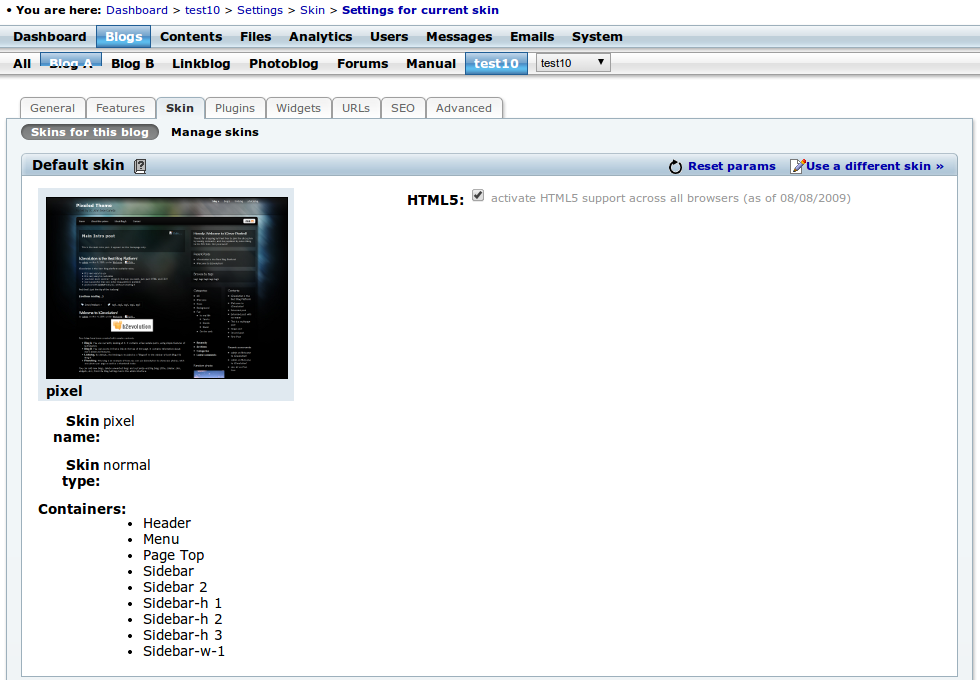
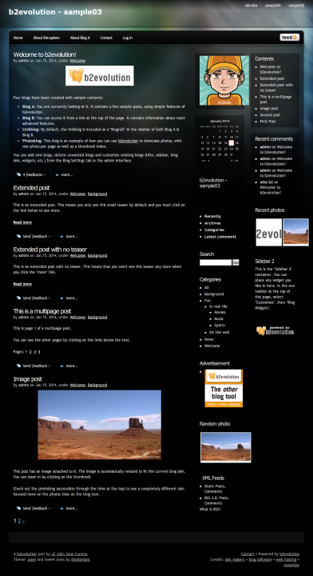
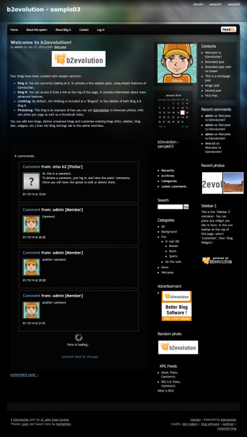

## Pixel skin for b2evolution CMS blog.

 
 
 
 

<h4>v1.1.1</h4>	
<ul>
	<li>Skin version fix</li>
</ul>

<h4>v1.1</h4>	
<ul>
	<li>Sitewide_header included for easier multi-blogging experience</li>
    <li>Visual improvements and adaptation to v6.6.+</li>
</ul>

 
This skin has been developed by a third party. It has been updated by the b2evolution group in an effort to make it work with the latest version of b2evolution. However, this skin is not officially supported by the b2evolution group.
